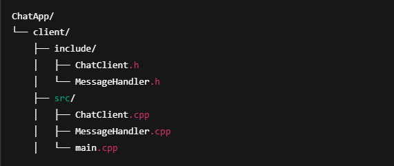
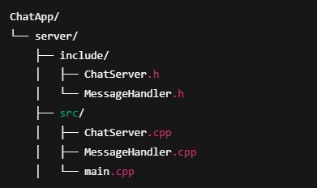
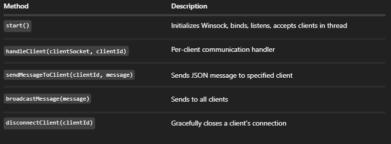
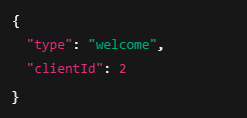
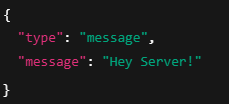
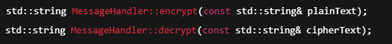
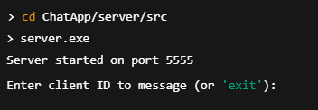
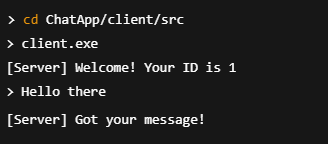
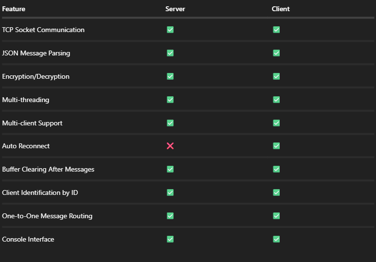

🧾 Project Documentation: Real-Time Chat System (C++ with Winsock & JSON)
  
  🔷 Overview
   This is a real-time, multi-client chat system implemented in C++ using Winsock for socket programming and nlohmann::json for structured message handling. The system consists of two main components:

   Client Module: Connects to the server, sends/receives encrypted JSON messages, supports auto-reconnect, and provides clean message output.

   Server Module: Accepts multiple clients, assigns client IDs, receives JSON messages, and routes them to specific or all clients.

🔹 Client Module
   📁 Structure

   
🧠 Responsibilities
-Connects to the server using IP and port.

-Receives a welcome message with assigned client ID.

-Sends and receives encrypted messages in JSON format.

-Auto-reconnects if connection is lost.

-Uses MessageHandler for encryption/decryption.

-Spawns a receiving thread for asynchronous message handling.   

🛠️ Key Class: ChatClient
   | Method                           | Description                                            |
| -------------------------------- | ------------------------------------------------------ |
| `connectToServer()`              | Initiates socket connection, receives welcome JSON     |
| `sendMessage(msg)`               | Sends a message (internally JSON)                      |
| `startReceiving()`               | Starts a thread that continuously listens for messages |
| `setOnMessageReceived(callback)` | Sets a callback to handle incoming messages            |
| `disconnect()`                   | Closes the socket                                      |
| `enableAutoReconnect(flag)`      | Enables retry if server disconnects                    |

📤 Message Format (Outgoing)
  {
  "type": "message",
  "message": "Hello!"
  }
📥 Message Format (Incoming)
  {
  "type": "message",
  "message": "Welcome to the server!"
  }
📬 Welcome Message
  {
  "type": "welcome",
  "clientId": 1
  }

  🔹 Server Module

   📁 Structure
   

🧠 Responsibilities
-Listens on a TCP port and accepts multiple clients.

-Assigns unique client IDs to each connected socket.

-Sends a welcome JSON message upon connection.

-Receives JSON-formatted messages from clients.

-Allows server admin to send messages to any connected client via ID.

-Uses MessageHandler for secure communication.

🛠️ Key Class: ChatServer
  
📤 Welcome Message Sent to Client
   

📥 Expected Client Message Format
   

🔐 MessageHandler (Used by Both Modules)
    Responsibilities
    -Abstracts message encryption/decryption.
    -Optional XOR-style obfuscation (can be upgraded to AES/RSA).
    -Ensures safe transport of JSON strings.
   
   

🔧 Dependencies
    

🔁 Sample Usage

✅ Starting Server
   

✅ Running Client
   

