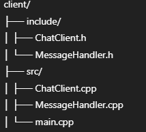

# 🧾 Real-Time Chat System (C++ with Winsock & JSON)

## 🔷 Overview

This is a real-time, multi-client chat system implemented in **C++** using **Winsock** for networking and **nlohmann::json** for structured message handling. It supports:

- Encrypted messaging using a `MessageHandler`
- Multi-threaded client/server communication
- Auto-reconnection and per-client messaging
- Modular and maintainable codebase

The system consists of two core components:

- **Client Module** – connects to the server, sends/receives messages
- **Server Module** – accepts multiple clients, routes messages, and handles communication

---

## 🔹 Client Module

### 📁 Structure

    


### 🧠 Responsibilities

- Connects to the server using provided IP and port
- Receives a JSON-based welcome message with an assigned `clientId`
- Sends and receives encrypted messages in **JSON** format
- Automatically reconnects if the connection is lost
- Handles message reception asynchronously via thread
- Uses `MessageHandler` for encryption and decryption

### 🛠️ Key Class: `ChatClient`

| Method                           | Description                                            |
| -------------------------------- | ------------------------------------------------------ |
| `connectToServer()`              | Initiates socket connection and receives welcome JSON  |
| `sendMessage(msg)`               | Sends a message (formatted internally as JSON)         |
| `startReceiving()`               | Starts a thread to listen for incoming messages        |
| `setOnMessageReceived(callback)` | Registers a callback for received messages             |
| `disconnect()`                   | Closes the socket connection                           |
| `enableAutoReconnect(flag)`      | Enables retry mechanism on disconnection               |

---

### 📤 Outgoing Message Format

```json
{
  "type": "message",
  "message": "Hello!"
}


### 📥 Incoming Message Format
 ```json
 {
  "type": "message",
  "message": "Welcome to the server!"
}

### 📬 Welcome Message Example
```json
{
  "type": "welcome",
  "clientId": 1
}

## 🔹 Server Module


> 

---

## 🧠 Responsibilities

- Accepts multiple TCP clients via Winsock.
- Assigns unique client IDs upon connection.
- Sends JSON welcome message to each new client.
- Parses incoming client messages (JSON format).
- Forwards messages to all clients or a specific one.
- Uses `MessageHandler` for JSON and optional obfuscation.
- Supports clean socket management and multithreading.

---

## 🛠️ Key Class: `ChatServer`

| Method                        | Description                                             |
|-----------------------------|---------------------------------------------------------|
| `start(uint16_t port)`      | Initializes and binds socket, begins accepting clients  |
| `acceptClients()`           | Listens for and handles new client connections          |
| `sendMessageToClient(id)`   | Sends a JSON message to a specific client               |
| `broadcastMessage(json)`    | Sends message to all connected clients                  |
| `receiveFromClient(id)`     | Receives JSON messages from a client                    |
| `disconnectClient(id)`      | Gracefully removes a client                             |

---

## 📤 Welcome Message Format (Sent to Clients)

```json
{
  "type": "welcome",
  "clientId": 1
}

### 📥 Expected Incoming Message Format
```json
{
  "type": "message",
  "message": "Hello from client"
}

###🔐 MessageHandler
The MessageHandler class handles:

🔄 Conversion between strings and JSON

🔒 Optional XOR-style obfuscation (easy to replace with AES/RSA)

📦 Clean formatting of messages for network transmission

###🔧 Dependencies
  🖥️ Platform: Windows (Winsock2)

  🧾 JSON Library: nlohmann/json.hpp

  🔧 Language: C++17

   📤 Threads: <thread>, <mutex> for concurrency

###📌 Notes
-Make sure to call WSAStartup() and WSACleanup() appropriately in main.cpp.

-Supports full-duplex messaging with client-side multithreaded listener.

-Use console input to send messages to specific clients by ID.


###🚀 How to Compile & Run from Console
   ✅ Recommended (With C++17 Support — Required for Structure Binding)
   Make sure your compiler supports C++17. You can compile and run using:

##🔹 Windows (MinGW or g++):
    g++ -std=c++17 -I./include -I../libs ./src/*.cpp -o ChatServer -lws2_32
    ./ChatServer

##🔹 Visual Studio Developer Command Prompt:
    cl /std:c++17 /I include /I ..\libs src\*.cpp /Fe:ChatServer.exe ws2_32.lib
    ChatServer.exe


